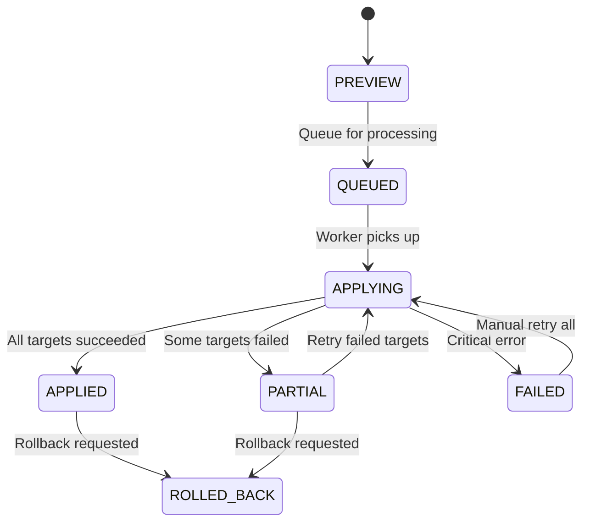
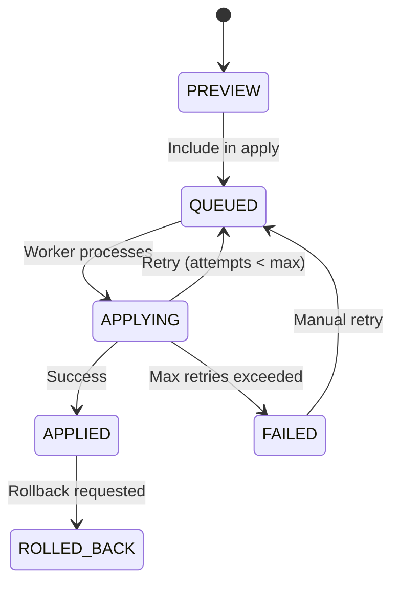

# Automation Runner State Machine

**Version**: 1.0.0
**Status**: M0.5 Foundation
**Last Updated**: November 13, 2025

---

## Overview

The Automation Runner uses a state machine pattern to manage the lifecycle of pricing rule executions. This ensures deterministic state transitions, proper error handling, and reliable retry logic for bulk price changes.

---

## RuleRun State Machine

### States

```
PREVIEW    → Initial state for preview/dry-run operations
QUEUED     → Queued for worker processing
APPLYING   → Currently being processed by worker
APPLIED    → All targets successfully applied
PARTIAL    → Some targets succeeded, some failed (retry available)
FAILED     → Critical error, all targets failed
ROLLED_BACK → Applied changes have been rolled back
```

### State Transitions



### Transition Rules

| From | To | Condition | Actor |
|:-----|:---|:----------|:------|
| PREVIEW | QUEUED | User/system queues for apply | API/Scheduler |
| QUEUED | APPLYING | Worker picks up from queue | Worker |
| APPLYING | APPLIED | All targets APPLIED | Worker |
| APPLYING | PARTIAL | Some targets FAILED, retries exhausted | Worker |
| APPLYING | FAILED | Critical error (DB, auth, etc.) | Worker |
| PARTIAL | APPLYING | Retry failed targets requested | API/User |
| FAILED | APPLYING | Manual retry all requested | API/User |
| APPLIED | ROLLED_BACK | Rollback requested | API/User |
| PARTIAL | ROLLED_BACK | Rollback requested | API/User |

### Invalid Transitions

- Cannot transition from APPLIED → APPLYING (immutable success)
- Cannot transition from ROLLED_BACK → APPLYING (create new run instead)
- Cannot transition directly from PREVIEW → APPLYING (must queue first)

---

## RuleTarget State Machine

### States

```
PREVIEW    → Initial state for preview/dry-run
QUEUED     → Queued for application
APPLYING   → Currently being applied
APPLIED    → Successfully applied
FAILED     → Failed after max retries
ROLLED_BACK → Applied change has been rolled back
```

### State Transitions



### Transition Rules

| From | To | Condition | Actor |
|:-----|:---|:----------|:------|
| PREVIEW | QUEUED | Include in rule run | API |
| QUEUED | APPLYING | Worker processes target | Worker |
| APPLYING | APPLIED | Price change succeeded | Worker |
| APPLYING | QUEUED | Retry (attempts < MAX_RETRIES) | Worker |
| APPLYING | FAILED | attempts >= MAX_RETRIES | Worker |
| FAILED | QUEUED | Manual retry requested | API/User |
| APPLIED | ROLLED_BACK | Rollback requested | API/User |

---

## Retry Logic

### Parameters

```typescript
const RETRY_CONFIG = {
  MAX_RETRIES: 3,              // Maximum retry attempts per target
  BASE_DELAY: 2000,            // Initial delay (2 seconds)
  MAX_DELAY: 64000,            // Maximum delay (64 seconds)
  MULTIPLIER: 2,               // Exponential multiplier
  JITTER: 0.2                  // Random jitter (±20%)
}
```

### Exponential Backoff

```
Attempt 1: 2s  (2000ms)
Attempt 2: 4s  (4000ms)
Attempt 3: 8s  (8000ms)
After max:  → FAILED, move to DLQ
```

### Jitter Calculation

```typescript
function calculateDelay(attempt: number): number {
  // Exponential: baseDelay * (multiplier ^ attempt)
  const delay = Math.min(
    BASE_DELAY * Math.pow(MULTIPLIER, attempt),
    MAX_DELAY
  )

  // Add jitter: ±20%
  const jitterAmount = delay * JITTER
  const jitter = Math.random() * jitterAmount * 2 - jitterAmount

  return Math.floor(delay + jitter)
}
```

### Example Timeline

```
Target fails at 10:00:00
  Attempt 1: 10:00:02 (2s + jitter)
  Attempt 2: 10:00:06 (4s + jitter)
  Attempt 3: 10:00:14 (8s + jitter)
  Max retries → FAILED, moved to DLQ
```

---

## 429 Rate Limit Handling

### Shopify Rate Limits

Shopify uses a leaky bucket algorithm with two limits:

1. **Request Limit**: 2 requests/second (burst: 40 requests)
2. **Cost Limit**: Based on GraphQL query complexity

### Detection

```typescript
function is429Error(error: Error): boolean {
  return error.statusCode === 429 ||
         error.code === 'THROTTLED'
}
```

### Backoff Strategy

```
429 Error Detected
  ↓
Check Retry-After header
  ↓ (if present)
Wait for Retry-After seconds
  ↓ (if absent)
Exponential backoff: 16s → 32s → 64s
```

### Implementation

```typescript
async function handle429Error(error: ShopifyError): Promise<number> {
  if (error.code === 429) {
    // Prefer Retry-After header
    const retryAfter = error.headers['retry-after']
    if (retryAfter) {
      return parseInt(retryAfter) * 1000 // Convert to ms
    }

    // Fallback to exponential backoff
    return calculateBackoff(error.attempt, {
      baseDelay: 16000,  // 16 seconds
      maxDelay: 64000,   // 64 seconds
      multiplier: 2
    })
  }

  throw error // Not a rate limit error
}
```

---

## Dead Letter Queue (DLQ)

### When Targets Enter DLQ

1. **Max Retries Exceeded**: After 3 failed attempts
2. **Unrecoverable Error**: Auth failure, invalid data, etc.
3. **Timeout**: Processing exceeds timeout threshold

### DLQ Structure

```typescript
// Targets in FAILED state are considered in DLQ
const dlqTargets = await prisma.ruleTarget.findMany({
  where: { status: 'FAILED' }
})
```

### DLQ Operations

```typescript
// 1. Drain DLQ (generate report)
const report = await dlqService.drainDLQ(projectId)

// 2. Retry failed targets
await dlqService.retryFailed(runId, targetIds)

// 3. Bulk retry all failed in run
await dlqService.retryFailed(runId) // No targetIds = all
```

---

## Reconciliation

### Purpose

Verify that applied price changes in the database match external systems (Shopify, Amazon, etc.).

### Process

```
1. Query APPLIED targets from run
2. For each target:
   a. Fetch current price from external system
   b. Compare with target.afterJson.unit_amount
   c. If mismatch → Report anomaly
   d. Optionally schedule retry
3. Generate reconciliation report
```

### Implementation

```typescript
async function reconcileRun(runId: string): Promise<ReconciliationReport> {
  const targets = await getAppliedTargets(runId)
  const mismatches: Mismatch[] = []

  for (const target of targets) {
    const externalPrice = await fetchExternalPrice(target)
    const expectedPrice = target.afterJson.unit_amount

    if (externalPrice !== expectedPrice) {
      mismatches.push({
        targetId: target.id,
        expected: expectedPrice,
        actual: externalPrice,
        difference: externalPrice - expectedPrice
      })

      // Emit audit event
      await eventWriter.writeEvent({
        eventType: 'automation.reconciliation.mismatch',
        payload: { targetId: target.id, expected, actual, difference }
      })
    }
  }

  return {
    totalChecked: targets.length,
    mismatches: mismatches.length,
    details: mismatches
  }
}
```

### Reconciliation Schedule

- **Immediate**: After run completes (within 5 minutes)
- **Delayed**: 1 hour after completion
- **Periodic**: Daily for all APPLIED runs in last 30 days

---

## Idempotency

### Event Key Generation

```typescript
function generateEventKey(run: RuleRun, target: RuleTarget): string {
  return `${run.id}:${target.id}:apply:${target.attempts}`
}
```

### Deduplication

The event bus uses `(eventKey, tenantId)` unique constraint to prevent duplicate processing.

```typescript
// Safe to retry - will dedupe automatically
await eventWriter.writeEvent({
  eventKey: generateEventKey(run, target),
  tenantId: run.tenantId,
  eventType: 'automation.target.apply',
  payload: { targetId: target.id, runId: run.id }
})
```

---

## Metrics & Monitoring

### Key Metrics

| Metric | Type | Description |
|:-------|:-----|:------------|
| `rules.apply.count` | Counter | Total apply operations |
| `rules.apply.duration_ms` | Histogram | Time to complete run |
| `rules.apply.success_rate` | Gauge | Percentage of successful targets |
| `rules.dlq.size` | Gauge | Number of targets in DLQ |
| `rules.target.retries` | Counter | Total retry attempts |
| `rules.429.count` | Counter | Rate limit errors |

### Alert Policies

| Alert | Condition | Severity | Action |
|:------|:----------|:---------|:-------|
| Low Success Rate | success_rate < 97% | Warning | Slack #engineering |
| Critical Success Rate | success_rate < 90% | Critical | PagerDuty |
| DLQ Backlog | dlq.size > 50 | Warning | Investigate |
| DLQ Critical | dlq.size > 100 | Critical | PagerDuty |
| 429 Burst | 429.count > 3 in 5 min | Warning | Slow down |

---

## Best Practices

### 1. Always Queue Before Applying

```typescript
// ✅ Good: Queue first
const run = await createRuleRun({ status: 'QUEUED' })
await queueForProcessing(run.id)

// ❌ Bad: Skip queue
const run = await createRuleRun({ status: 'APPLYING' }) // Invalid transition
```

### 2. Use Correlation IDs

```typescript
const run = await createRuleRun({
  metadata: {
    actor: userId,
    correlationId: requestId,  // Track across services
    source: 'api'
  }
})
```

### 3. Handle Partial States

```typescript
if (run.status === 'PARTIAL') {
  // Show "Retry Failed" button
  // Display failed targets count
  // Allow partial rollback
}
```

### 4. Implement Circuit Breaker

```typescript
if (consecutive429Errors > 5) {
  // Pause processing for 60 seconds
  await pauseWorker(60000)
  // Alert operations team
  await alertOps('Circuit breaker triggered')
}
```

---

## State Validation

### Invariants

```typescript
// RuleRun invariants
assert(run.queuedAt <= run.startedAt) // Can't start before queued
assert(run.startedAt <= run.finishedAt) // Can't finish before start
assert(run.status !== 'APPLIED' || allTargetsApplied) // APPLIED requires all targets succeeded

// RuleTarget invariants
assert(target.attempts >= 0) // Non-negative attempts
assert(target.attempts <= MAX_RETRIES || target.status === 'FAILED') // Max retries enforced
assert(target.status === 'APPLIED' => target.appliedAt !== null) // appliedAt required when APPLIED
```

### State Checks

```typescript
function validateRunState(run: RuleRun): void {
  if (run.status === 'APPLIED') {
    const failedTargets = await prisma.ruleTarget.count({
      where: { ruleRunId: run.id, status: 'FAILED' }
    })

    if (failedTargets > 0) {
      throw new Error('Run marked APPLIED but has failed targets')
    }
  }
}
```

---

## References

- [Event-Driven State Machines](https://martinfowler.com/eaaDev/EventSourcing.html)
- [Saga Pattern](https://microservices.io/patterns/data/saga.html)
- [Exponential Backoff](https://cloud.google.com/iot/docs/how-tos/exponential-backoff)
- [Shopify API Rate Limits](https://shopify.dev/api/usage/rate-limits)

---

**Next**: See [retry-logic.md](./retry-logic.md) for detailed retry implementation
